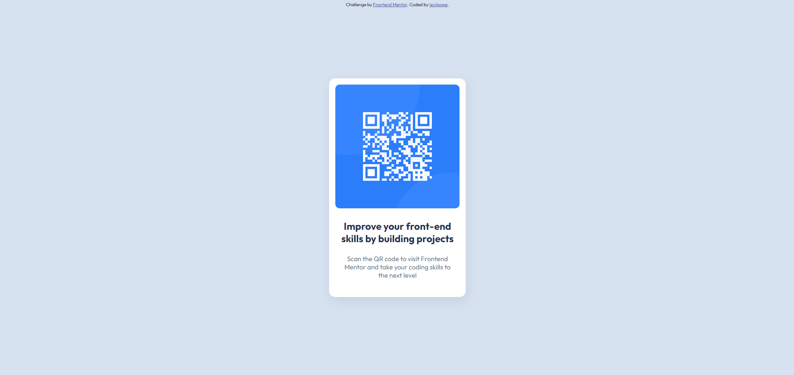

# Frontend Mentor - QR code component solution

This is a solution to the [QR code component challenge on Frontend Mentor](https://www.frontendmentor.io/challenges/qr-code-component-iux_sIO_H).

### Screenshot of the page

### Links

- Live Site URL: https://leviipope.github.io/frontend-mentor-qr-code
- My Website - https://leviipope.github.io/cv-website
- Frontend Mentor profile - [@leviipope](https://www.frontendmentor.io/profile/leviipope)
- Github - [leviipope](https://github.com/leviipope)
